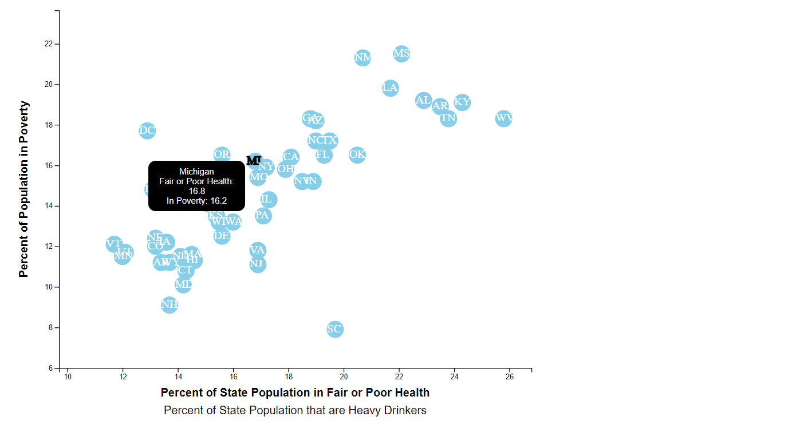

# D3-Demographics
## Background

This project analyzes the current trends shaping people's lives, by looking at the health risks facing particular demographics.
In order to find pertinent data, I pulled from the U.S. Census Bureau and the Behavioral Risk Factor Surveillance System.  In particular,
I looked at  demographic information from the 2014 one-year estimates on the U.S. Census Bureau's
American Community Survey website.  The demographic I chose was those at or below poverty level in all 50 states.

Next, I pulled data on health risks using 2014 survey data from the [Behavioral Risk Factor Surveillance System](https://chronicdata.cdc.gov/Behavioral-Risk-Factors/BRFSS-2014-Overall/5ra3-ixqq). The two behavioral risks I looked at
were those in fair or poor health and those who engage in heavy drinking of alcohol.  There were other risk factors that peaked my
curiosity but they did not pass the test when I evaluated them using the metric below.

I looked at multiple datasets and used Excel's correlation function to find if there was any correlation between behavioral risks and poverty.
To find a moderate correlation I aimed for a value either less than -0.5 or more than 0.5.  Poverty and fair to poor health came in at .85 and
heavy drinking had a negative correlation at -.35.

After finding correlation, I cleaned up the data so that it would play nicely with JavaScript and D3.  My data is stored in the file: `data.csv`.

Next, I created a scatter plot that represents each state with circle elements. You can find the code for this in the `app.js` file.  My app  pulls
 in the data from `data.csv` by using the `d3.csv` function. My y-values of the circles match the demographic census data, and the x-values
  represent the risk data.  In each circle I appended the state abbreviations for easier perusal.

* Note: if you want to check out the fully functioning HTML page, you'll need to use `http-server` from a command terminal to display the graphic.
Each datapoint is clickable and displays the poverty percentage along with your chosen risk factor percentage.

Here is a screenshot of the chart:

-
